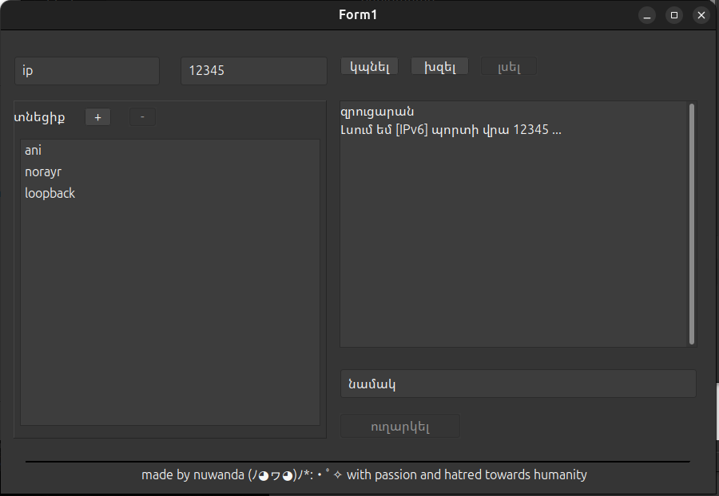
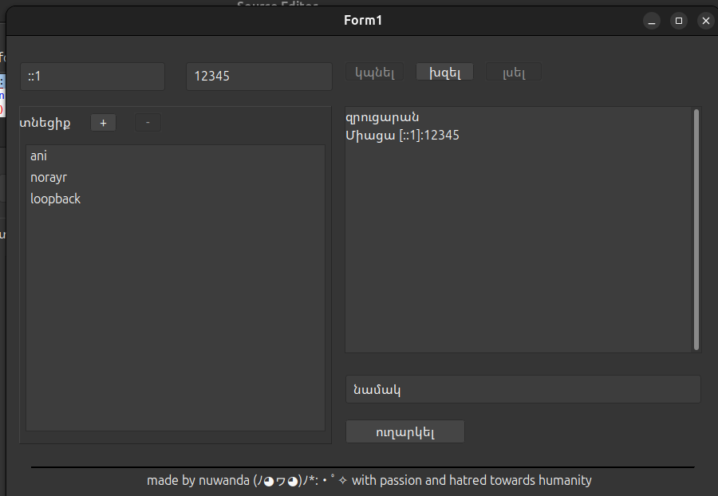
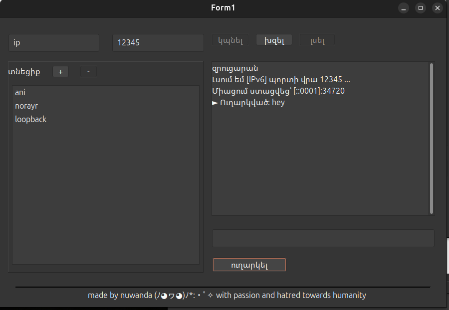
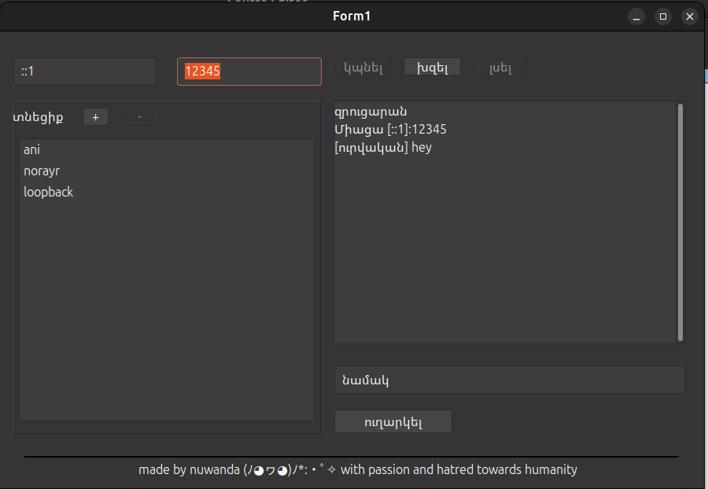

# NetCatGUI – IPv6 Chat Tool

NetCatGUI is a simple peer-to-peer chat application written in FreePascal (FPC) using Lazarus IDE.  
It uses pure system sockets without external libraries and supports full IPv6 communication.

*please refer to https://aniordyan.github.io/yggdrasilInfo/ to get ipv6 address*

## Features

- Full IPv6 support (connect to any valid IPv6 address)
- Multi-threaded design:
  - Receiver thread for incoming data
  - Listener thread for accepting connections
- Buddy system for storing named contacts in `buddies.conf`
- Simple graphical chat interface
- Cross-platform

---

## Build Instructions

### Requirements

- FreePascal 3.2 or newer  
- Lazarus 2.2 or newer  

### Building the Application

1. Clone the repository or download the source.  
2. Open the project file `netcatGui.lpi` in Lazarus.  
3. Build the project using the Lazarus Build command.  
4. Run the resulting executable.

---

## Technical Overview

### Client Mode

When initiating a connection:

- A socket is created with `AF_INET6`.
- The IPv6 address string is parsed using `StrToHostAddr6`.
- A `fpConnect` call establishes the TCP connection.
- A receiver thread begins reading from the socket using `fpSelect` and `fpRecv`.

### Server Mode

When listening:

- A listening socket is created using:  
  `fpSocket(AF_INET6, SOCK_STREAM, 0)`
- The address `::` is bound, enabling listening on all IPv6 interfaces.
- Incoming connections are accepted in a dedicated acceptor thread.

### Message Handling

- Outgoing messages use `fpSend`.
- Incoming data is read using `fpSelect` and `fpRecv`.
- Data is buffered and split into lines before being appended to the UI.

---

## Usage Examples






## Buddy System

The application stores named contacts inside `buddies.conf` using an INI format.  
Each buddy entry contains:

- Host (IPv6 address)
- Port
- Display name

Double-clicking a buddy attempts to connect automatically.

---

## Project Structure

```
mainform.pas          Main GUI and networking logic
uBuddies.pas          Buddy manager
netcatGui.lpi         Lazarus project file
buddies.conf              Saved contacts file
README.md                 Project documentation
```

---

## License

---

## Contributing

Pull requests, bug reports, and feature suggestions are welcome.

